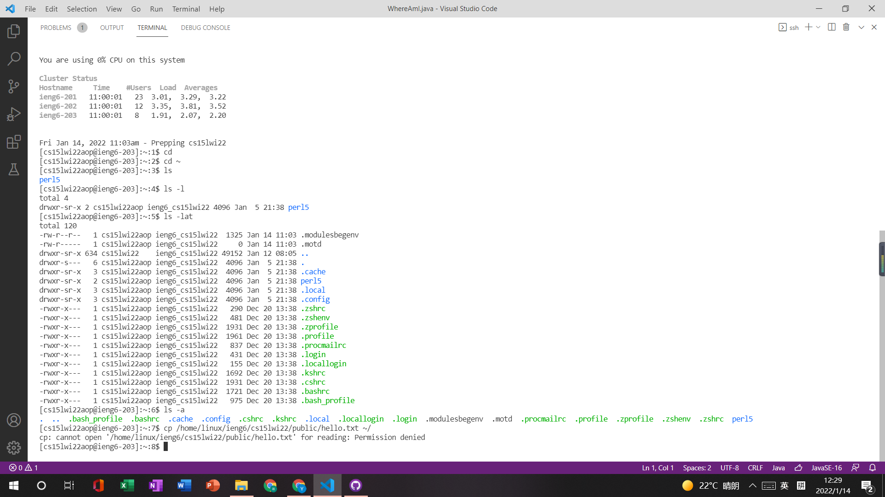

# **WEEK2 Lab Report**

## Instructions about how to log into a course-specific account on ieng6 
***

1. **Installing VScode** 

    Go to the Visual Studio Code website https://code.visualstudio.com/, and follow the instructions to download and install it on your computer. Download the version for your       operating system.

  

   I download the version for Windows x64 from https://code.visualstudio.com/. Then, I install it in D drive of my laptop. After installation,  a window that looks like the        picture above will be shown.
***
2. **Remotely Connecting**

   First, download SSH at https://docs.microsoft.com/en-us/windows-server/administration/openssh/openssh_install_firstuse. Then, look up your student account for CSE15L at          https://sdacs.ucsd.edu/~icc/index.php. After that, go to VSCode. 

    

    In the terminal, I put in the command  **ssh cs15lwi22aop@ieng6.ucsd.edu**. After typing in my password and choosing "y", I connected to the server **ieng6**.
***
3. **Trying Some Commands**

    In pictures below, I'm tring some commands. 

    

    

    In the first picture, I tried several **ls** related commands. All commands relates to **ls** are about listing directorty contents. The simple **ls** command  List             information about the Files in the current directory by  default. The **ls -l** command will use a long listing format. 

    In the second picture, I used Ctrl-D to logout This can also be achieved by running the command **exit**.
***
4. **Moving Files with scp**

    Then, I went back to my laptop(client) and try to use **scp** command to move files to the server. 

    

    Frst of all, I created a java file on my desktop. Then, I typed                                                       
    **scp WhereAmI.java cs15lwi22zz@ieng6.ucsd.edu:~/** on terminal. After typing in password, I copied the file into the server. At last, I logged in the server to check if I       successfully copied the file. 
***
5. **Setting an SSH Key** 

    I created a **SSH Key** in two steps.

    

    By calling command: **ssh-keygen** and setting the location of storing the key at **\Users\hp/.ssh/id_rsa**,
    I created two new files on your system; the private key (in a file id_rsa) and the public key (in a file id_rsa.pub), stored in the .ssh directory on your computer.

    Then, after creating an directory on the server by using command **mkdir .ssh** I went back to my laptop(client) and ran the command 
    **scp \Users\hp/.ssh/id_rsa.pub cs15lwi22aop@ieng6.ucsd.edu:~/.ssh/authorized_keys** to copy the public key to the **.ssh** directory of my user account on the server.

    After these two steps, I can do ssh or scp from client to the server without entering my password.
***
6. **Optimizing Remote Running**

    

    I tried to write the command in quotes to directly run it on the remote server. 
    Then, I tried to seperate command by semicolons and run all of them in the smae line. Running on the server is much more efficient than running on client. 

