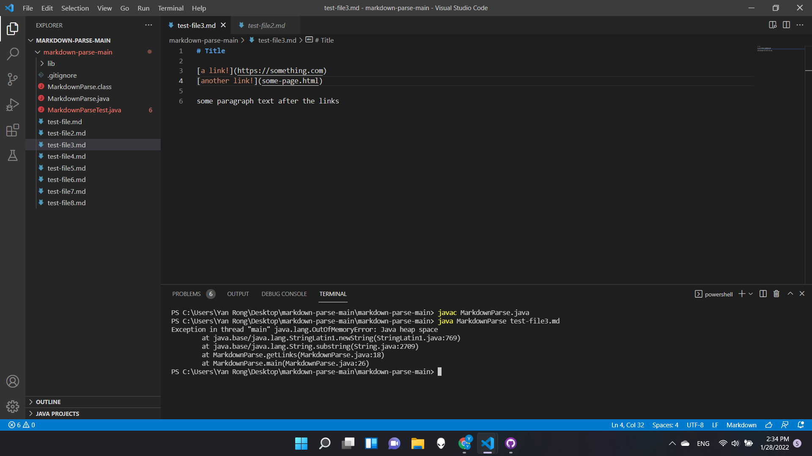

# **WEEK4 Lab Report**

## Debugging on the MarkdownParse.java 
***
1. **Fixing the problem when parentheses and brackets not appear in pairs or the whole file does not end with a parenthese** 





the test file use is under this link (2 ouput screenshot might used files with different names, but the contents are always the same)

[test-file3](https://ryanrongy.github.io/cse15l-lab-reports/test-file3.md)

The errors will be reported while the parentheses and brackets are not appeared in pairs, which means that link is not complete. 
In that case, the bug should be some of the variables can't be initialized or updated correctly, and the symptom here will be an infinite loop when closing brackets or parentheses missing. Moreover, when there are other contents after the last closing parenthese.

***


2. **Fixing the printing error when an image link is given**


the test file use is under this link (2 ouput screenshot might used files with different names, but the contents are always the same)

[test-file6](https://ryanrongy.github.io/cse15l-lab-reports/test-file6.md)

The error appears when the Markdown file read contians images in it. The difference between a normal link and a image link is that the image links start with ```!``` sign. After fixing the bug, the output can rule out image links from the file. 

3. **Fixing the error when the input args have different length**


the test files use are under these links (2 ouput screenshot might used files with different names, but the contents are always the same)

[test-file1](https://ryanrongy.github.io/cse15l-lab-reports/test-file.md) [test-file2](https://ryanrongy.github.io/cse15l-lab-reports/test-file2.md)

This error appears when the input string array length is not strictly 1. When the lenght is different, a symtom like ```Exception in thread "main" java.lang IndexOutOfBoundsException: Index: 0, Size: 0``` will be reported. 
