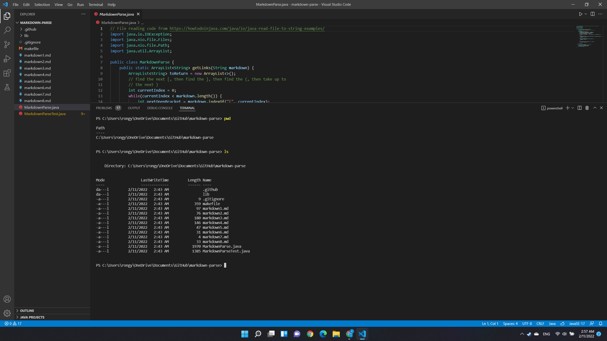
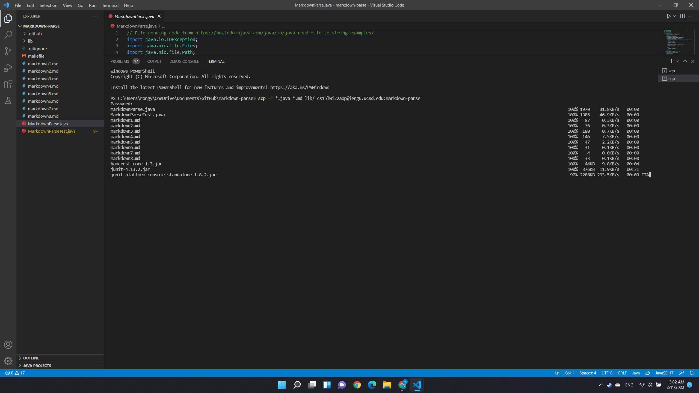
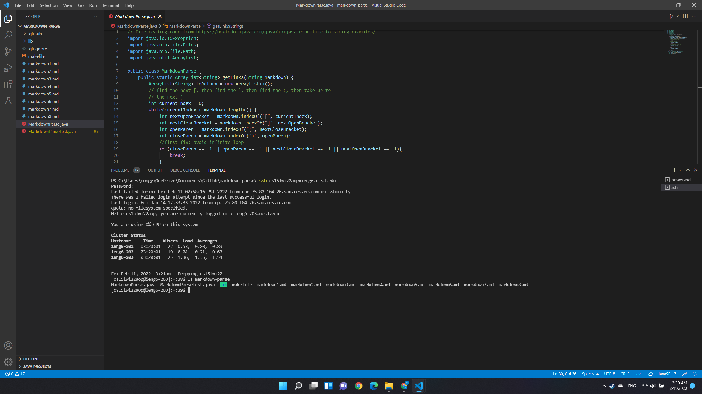
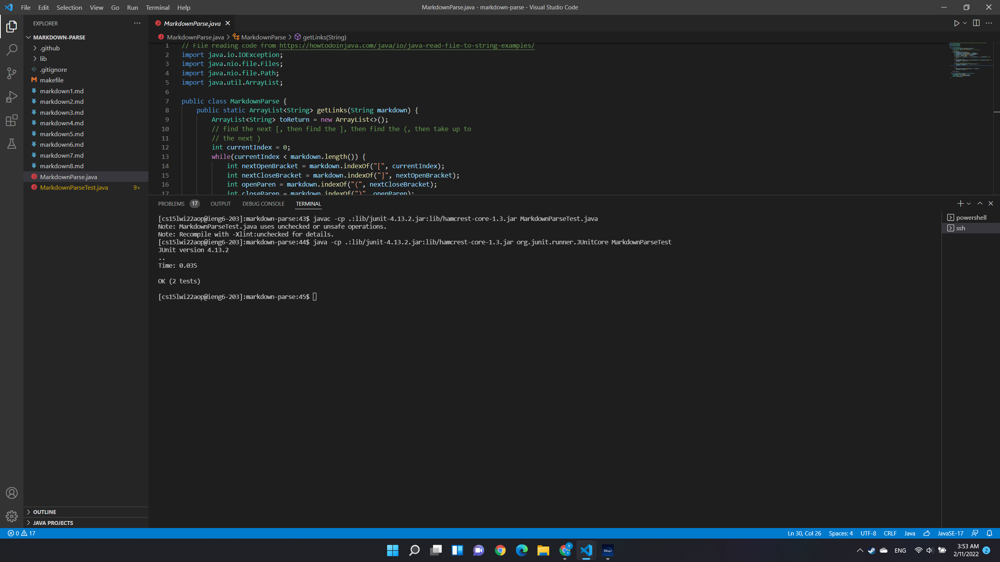
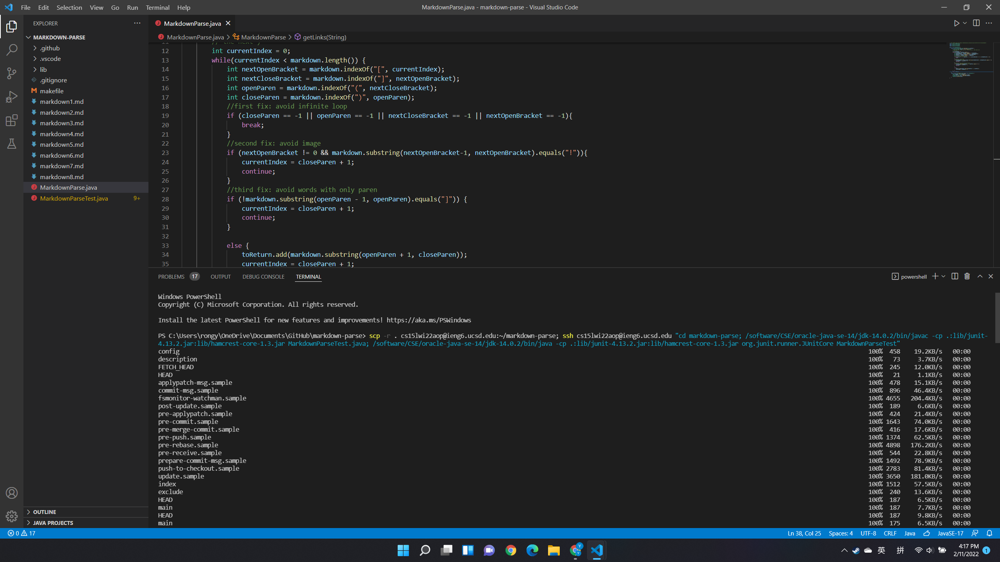
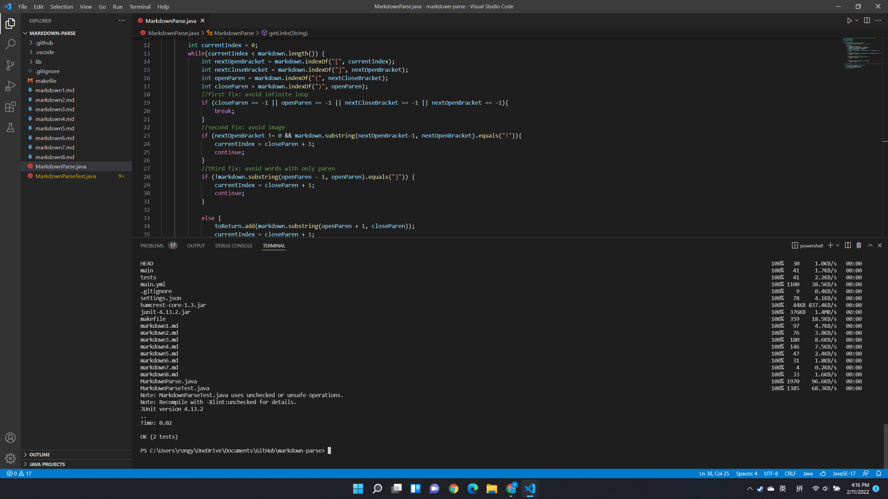

# **WEEK6 Lab Report**
## Copy whole directories `scp -r`
***
1. Before Everything 

I used the commands `pwd` and `ls` to show where I am on the computer and list out all the files in my current directory. After that, I can see all the files that I need to copy to the `ieng6`

***
2. Copying the Files

After knowing files I need to copy, I am going to copy all the files from my `markdown-parse` directory to my account on the `ieng` server under the directory named `markdown-parse`, Then, I use the command 

`$ scp -r *.java *.md lib/ cs15lwi22@ieng6.ucsd.edu:markdown-parse` 
to atucally copy all the files at the location
`C:\Users\rongy\OneDrive\Documents\GitHub\markdown-parse` to the newly-created directory in my `markdown-parse` directory on the server.
I choose the `scp` command above to avoid copying all the `.git` files to the directory as well.

***

3. Checking All the Copied Files

I need to log in with password this time is because I'm using a different device, and it doesn't store my key. 
After that, I use the commands `ls` after logging in to my account on `ieng6`

***

4. Running java files and their tests remotely

After done with copying and logging in, I tried to run the test file of `MarkdownParse.java` called `MarkdownParseTest.java` remotely on the server. 

First of all I need to compile the files with 

`javac -cp .:lib/junit-4.13.2.jar:lib/hamcrest-core-1.3.jar MarkdownParseTest.java` .

Then, I atucally run the test with 

`java -cp .:lib/junit-4.13.2.jar:lib/hamcrest-core-1.3.jar org.junit.runner.JUnitCore MarkdownParseTest`.

As a result, all the tests were passed 

5. Combining All the Commands in a Single Line

I used the command 

`scp -r . cs15lwi22aop@ieng6.ucsd.edu:~/markdown-parse; ssh cs15lwi22aop@ieng6.ucsd.edu "cd markdown-parse; /software/CSE/oracle-java-se-14/jdk-14.0.2/bin/javac -cp .:lib/junit-4.13.2.jar:lib/hamcrest-core-1.3.jar MarkdownParseTest.java; /software/CSE/oracle-java-se-14/jdk-14.0.2/bin/java -cp .:lib/junit-4.13.2.jar:lib/hamcrest-core-1.3.jar org.junit.runner.JUnitCore MarkdownParseTest"` 

to combine copying and running the test on the server.

the first screen shot is the command, and the second one is the output in the terminal. 

With this command I was able to run all the commands above in a single line. 

