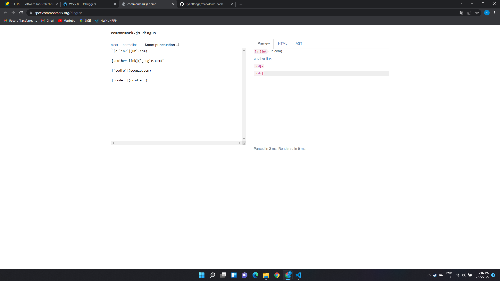
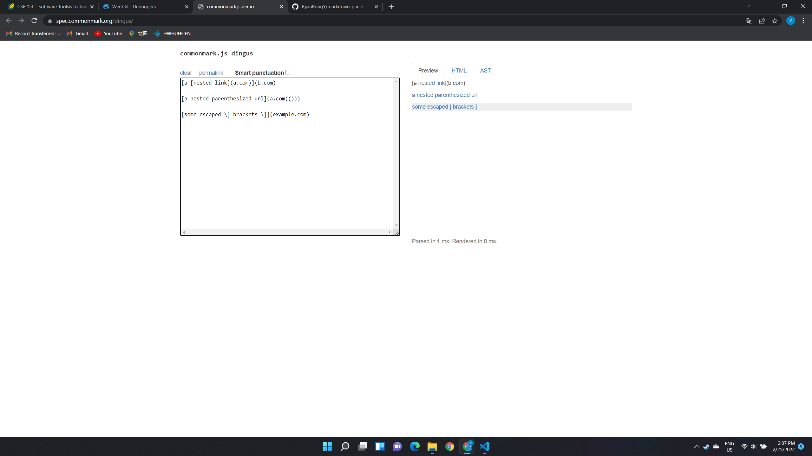
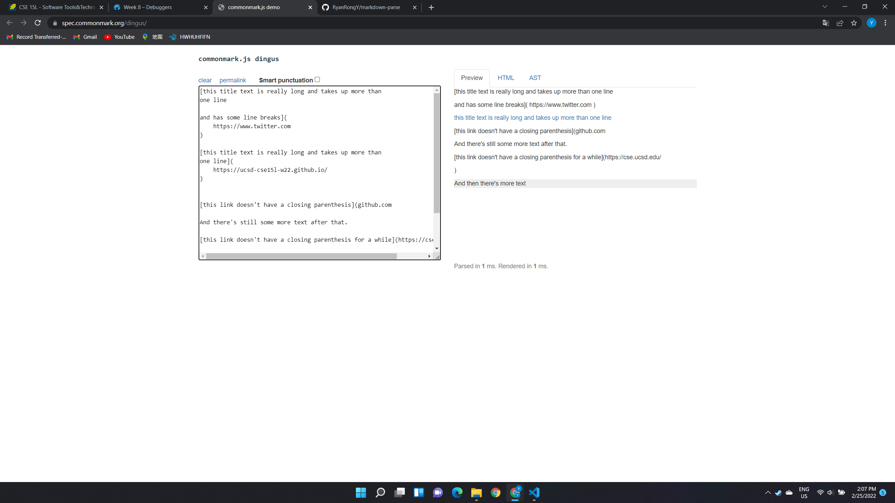
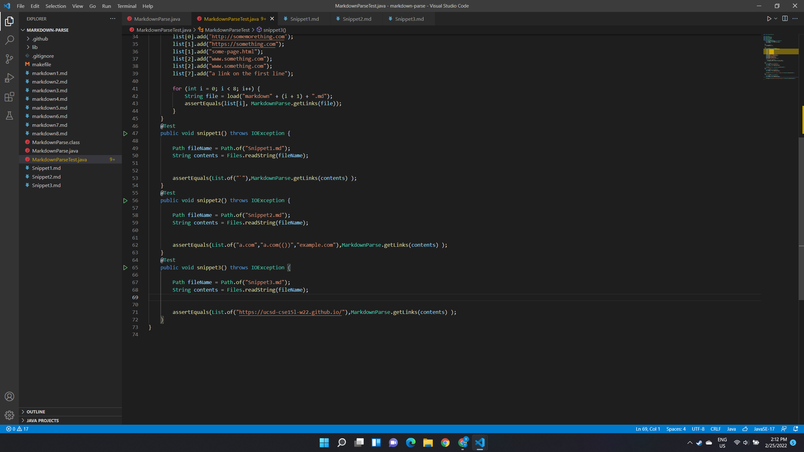
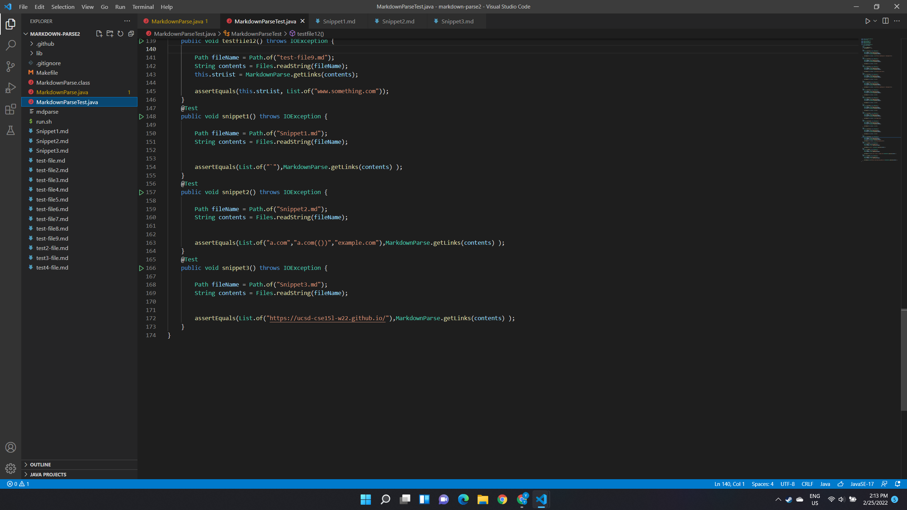
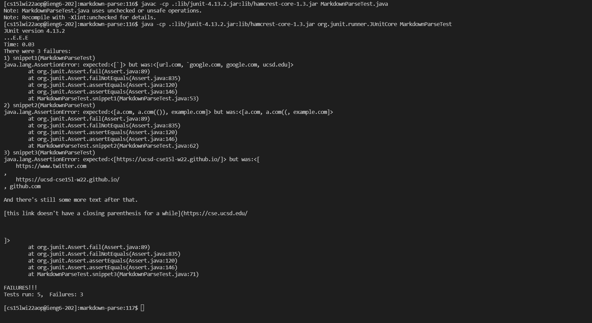
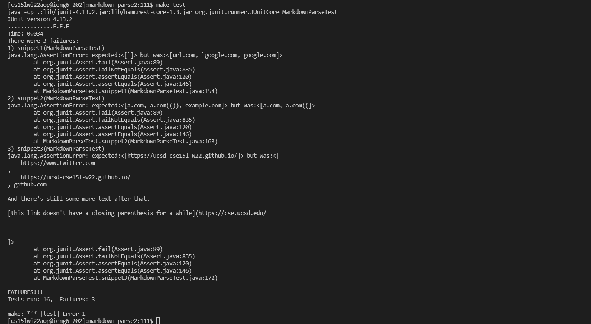

# **WEEK 8 Lab Report**
## Testing Markdown Snippets
***
- ### ***markdown-parse repositories I used in this report***

    [The repository my group fixed](https://github.com/tylercyang/markdown-parse)
 
    [My group's repository](https://github.com/RyanRongY/markdown-parse)

***

- ### ***Expected test result form CommonMark demo site***

    *Snippet 1*
    

    *Snippet 2*
    

    *Snippet 3*
    

***

- ### ***Tests I wrote for both my repository and the repository I reviewed***

    *My repository tests*
    

    *Repository I reviewed*
    

***

- ### ***Test results for both repositories***

    *My repository test results*
    

    *Reviewed repository test results*
    

***

- ### ***Reflection on how to fix the bugs***

    *For Snippet1.md*

    I think this bug can be fixed within 10 lines. To approach that, when we are iterating through the `.md` file, we can check whether the character at current location equals to backticks, if so, we can find the next bakc tick and skip the code in between by making adjustments to the current index. 

    *For Snippet2.md*

    I think this bug can be fixed within 10 lines. When there are nested parentheses, brackets, and escaped brackets, I think we can implement a new method to check wether the whole clustered parentheses and brackets match with each other. For example, whether all open parens have corresponding close parens and no other single parens or brackets in between. After checking the cluster matching or not, we just simply add everything between the outermost pair of parens to the returning variable. 

    *For Snippet3.md*

    I don't think this bug can be fixed within 10 lines. First of all, we would need to implement some changes about skipping `'\n'` characters while iterating through the whole `.md` file. Moreover, this test file also has the problem of not matching parens and brackets. We also need to implement a method similar to the adjustment for `Snippet2.md` as stated above. Since we need to make such 2 changes, I think it impractical to make the program work for this file with small code changes. 
